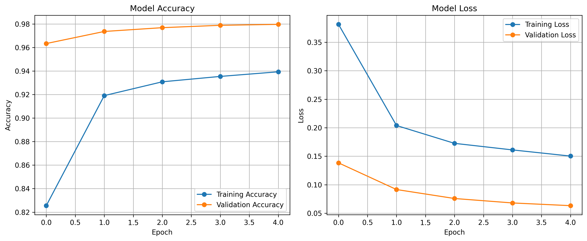
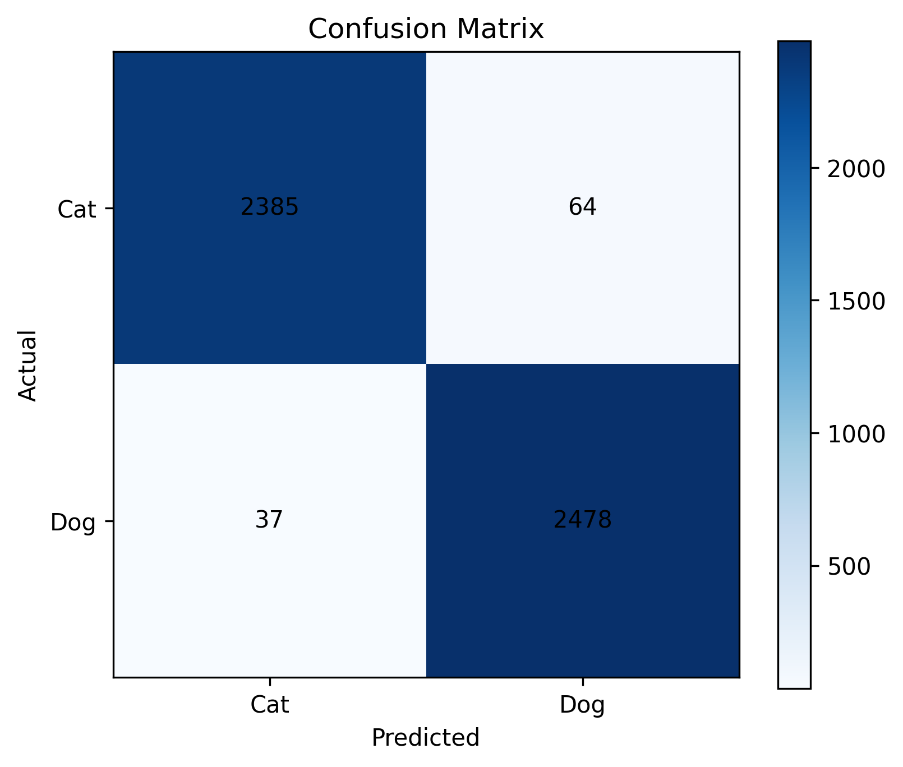
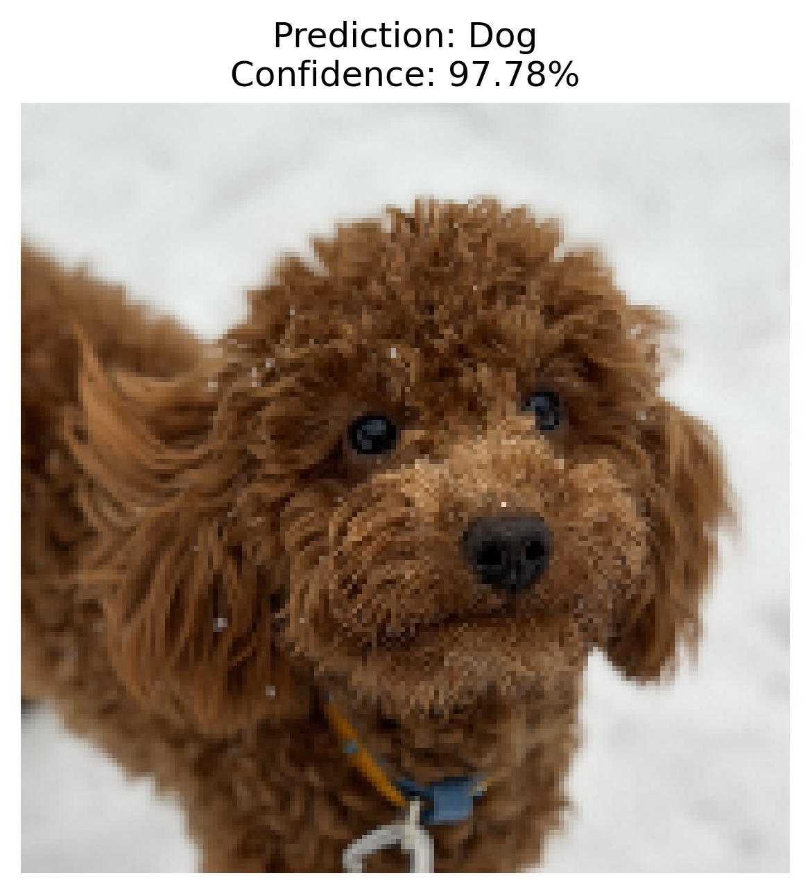

# 🐱🐶 Cats vs Dogs Image Classification using MobileNetV2 Transfer Learning

## 📌 Project Overview

This project demonstrates a complete deep learning workflow for binary image classification using transfer learning.

The objective is to classify images as either **cats** or **dogs** using a pretrained MobileNetV2 convolutional neural network.

The project includes:

- Dataset loading
- Data preprocessing
- Data augmentation
- Transfer learning
- Model training
- Model evaluation
- Prediction on new images
- Model saving

---

## 📂 Dataset

The project uses the **Microsoft Cats and Dogs Dataset**, which contains over **25,000 images** of cats and dogs.

Classes:

- 🐱 Cat
- 🐶 Dog

All images were resized to **160×160** pixels before training.

---

## 🧠 Model Architecture

The model is based on **MobileNetV2**, pretrained on the ImageNet dataset.

Architecture:

- MobileNetV2 (Feature Extractor)
- GlobalAveragePooling2D
- Dropout
- Dense (Sigmoid)

Only the final classification layer was trained.

---

## ⚙️ Data Preprocessing

The following preprocessing steps were applied:

- Removing corrupted images
- Image resizing
- Data augmentation
- Batch generation
- Prefetching

Data augmentation includes:

- Random horizontal flip
- Random rotation
- Random zoom

---

## 🚀 Training

**Optimizer**

- Adam

**Loss Function**

- Binary Crossentropy

**Callbacks**

- EarlyStopping
- ModelCheckpoint

**Epochs**

- 5

---

## 📊 Results

| Metric | Value |
|--------|-------|
| Validation Accuracy | **97.97%** |
| Validation Loss | **0.0632** |
| Precision | **0.98** |
| Recall | **0.98** |
| F1-score | **0.98** |

The model achieved high classification performance while maintaining a low validation loss.

---

## Training Curves



---

## Confusion Matrix



---

## Example Prediction



---

## 🔍 Example Prediction

The trained model correctly classified a new image with a confidence of **97.78%**.

---

## 💻 Technologies

- Python
- TensorFlow
- Keras
- MobileNetV2
- NumPy
- Matplotlib
- Scikit-learn

---

## 📁 Project Structure

```text
Cats-vs-Dogs-Classification/

├── Cats_vs_Dogs_Classification.ipynb
├── README.md
├── requirements.txt

├── model/
│   ├── best_model.keras
│   └── cats_vs_dogs_mobilenetv2.keras

├── results/

└── images/
```

---

## 🔮 Future Improvements

Possible future improvements include:

- Fine-tuning MobileNetV2
- Testing other CNN architectures
- Hyperparameter optimization
- Deploying the model as a web application

---

## 👩‍💻 Author

Iryna Mazurkevych.

Final Capstone Project for the Deep Learning course.